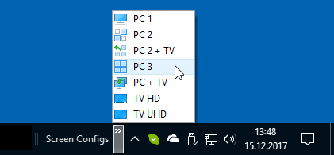

Display Manager
===============

[![License][license-img]][license-url]
[![GitHub Release][release-img]][release-url]
[![Github Releases][downloads-img]][downloads-url]
[![GitHub Issues][issues-img]][issues-url]

> A command line tool for recording and restoring Windows display configurations

## Use Case

* You have a Windows 8/10 PC with a couple of monitors / flatscreen TVs attached
* You are not always using all of your monitors, instead you like to switch between different display configurations

## Usage

This tool is quite minimalistic.

1. Use the Windows display settings dialog to configure your monitors to your liking
2. Run `DisplayMan.exe --save MyDisplayConfigA.xml` on the command line
3. Configure your monitors in another way
4. Run `DisplayMan.exe --save MyDisplayConfigB.xml`

Now you have two recorded configurations and you can toggle between them

1. Run `DisplayMan.exe --load MyDisplayConfigB.xml`
2. Run `DisplayMan.exe --load MyDisplayConfigA.xml`

It is a good idea to create links (shortcuts) for the different configurations, with nice icons, of course.
You can place these links on the desktop or in a toolbar inside the taskbar.



## Help Text

```
Mastersign DisplayManager
-------------------------
Version: 1.1.0

Usage:
  DisplayMan
      With no arguments: Show the current display configuration.
  DisplayMan <file path>
      With one file path as the only argument:
      Load display configuration from XML file persistently.
  DisplayMan [<options>]*
      With one or more options: See descriptions below.

Options:

  -h, --help, -?, /?
      Does print this help text. Ignores all other options.

  -v, --version
      Prints version information. Ignores all other options.

  -i, --info, --show-config
      Show the current display configuration.

  -s, --save, --record <target file>
      Write the current display configuration to an XML file.

  -l, --load, --restore <source file>
      Loads the display configuration from the specified XML file.
      If this option is used, the --reset option is ignored.
      By default, the configuration is loaded temporarily.

  -p, --persistent
      If loading a display configuration, makes the new configuration
      persistent.

  -r, --reset
      Resets the display configuration to the last persistent state.
      Can be used to switch back after loading a display configuration
      temporarily.
```

## Hotkeys

A good combination also, is to run `DisplayMan.exe` with [AutoHotkey](https://autohotkey.com).

As a preparation, you need to place a copy of the AutoHotkey executable,
named `hotkeys.exe`, in the same folder as `DisplayMan.exe`.
Then create a AutoHotkey script, named `hotkeys.ahk`, besides `hotkeys.ahk`.
What is important, is that the script file has the same name as the executable.
This way you can just start `hotkeys.exe` and it will find the AHK script
by itself.

To switch to `C:\Users\Me\Documents\MyDisplayConfigA.xml` by pressing `Win` + `Ctrl` + `A`,
you can use the following script (for AutoHotkey version 1.1) as a starting point:

```ahk
#NoEnv
SendMode Input
SetWorkingDir %A_ScriptDir%

SwitchToDisplayConfig(configFile)
{
    run, "%A_ScriptDir%\DisplayMan.exe" --load "%configFile%", %A_ScriptDir%, Min
}

#^A::SwitchToDisplayConfig("C:\Users\Me\Documents\MyDisplayConfigA.xml")
```

Now place a link (shortcut) for `hotkeys.exe` in your startmenus autorun folder,
and you can use the hotkey(s) even after a reboot.

## Technical Insight

This tool makes use of the [Windows API for Connecting and Configuring Displays](https://msdn.microsoft.com/en-us/library/windows/hardware/hh406259.aspx).
This API is available since Windows 7.
It only uses the methods
`QueryDisplayConfig`, `GetDisplayConfigBufferSize` and `SetDisplayConfig` in the `User32.dll`.
It does nothing more then to query the current configuration
and store it with the .NET XML serialization into a file.
For restore, it just loads the configuration with .NET XML deserializaton and passes them to the Windows API.

## Acknowledgements

After spending quite some time with the older API (`EnumDisplayDevices`, `ChangeDisplaySettings`, ...)
I finally found the [question](https://stackoverflow.com/questions/16082330)
of [Erti-Chris Eelmaa](https://stackoverflow.com/users/1936622)
with the answer from [Stephen Martin](https://stackoverflow.com/users/12845)
and edits from [Lennart](https://stackoverflow.com/users/368354) and
[David Heffernan](https://stackoverflow.com/users/505088)
on StackOverflow.
The rest was easy. Thanks a lot guys, you saved my day!

## License

This project is released under the MIT license.

Copyright &copy; by Tobias Kiertscher <dev@mastersign.de>.

[release-url]: https://github.com/mastersign/Mastersign.DisplayManager/releases/latest/
[release-img]: https://img.shields.io/github/release/mastersign/Mastersign.DisplayManager.svg?style=flat-square
[downloads-url]: https://github.com/mastersign/Mastersign.DisplayManager/releases/latest/
[downloads-img]: https://img.shields.io/github/downloads/mastersign/Mastersign.DisplayManager/total.svg?style=flat-square
[license-url]: https://github.com/mastersign/Mastersign.DisplayManager/blob/master/LICENSE.md
[license-img]: https://img.shields.io/github/license/mastersign/Mastersign.DisplayManager.svg?style=flat-square
[issues-url]: https://github.com/mastersign/Mastersign.DisplayManager/issues
[issues-img]: https://img.shields.io/github/issues/mastersign/Mastersign.DisplayManager.svg?style=flat-square